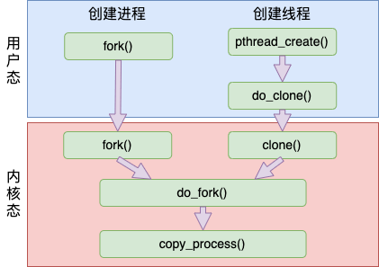
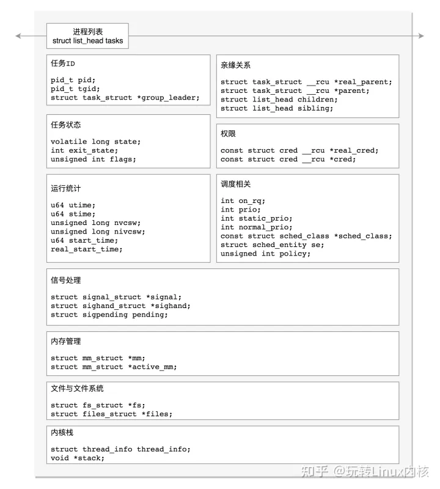
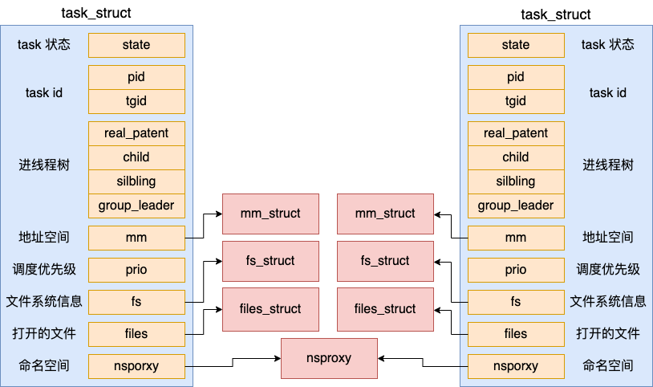
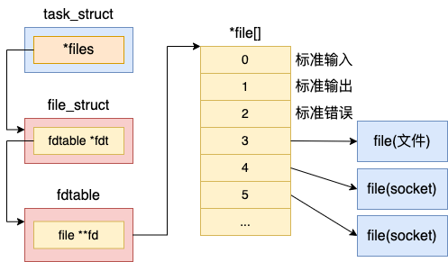
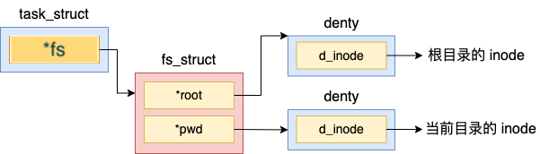
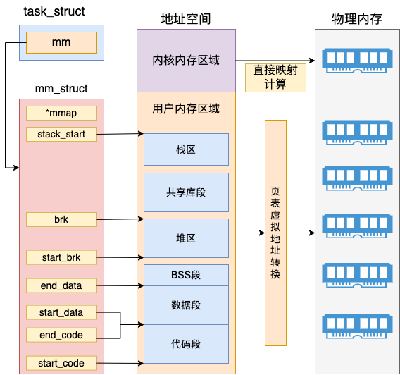
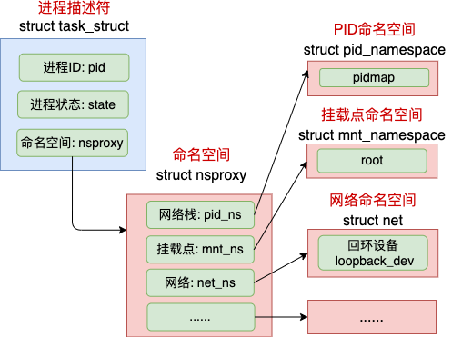
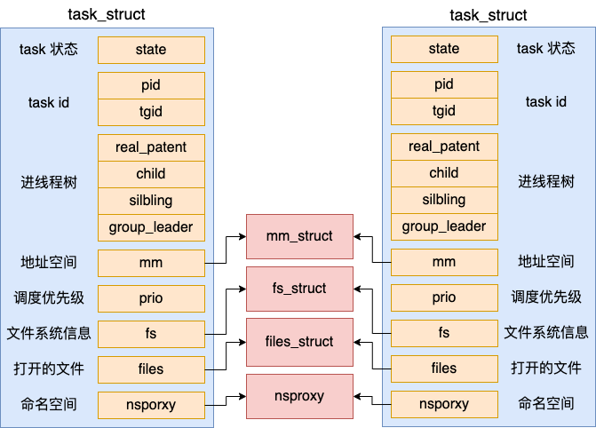

### 概要

主要通过对Linux中fork函数的实现来解析进程的创建过程

pthread_create函数的实现来解析线程程的创建过程



### Linux中对进程的描述

在 Linux 中，是用一个 [task_struct](data-struct/task_struct.md) 来实现 Linux 进程和线程的

1、进程之间都是独立的

2、地址空间是进程线程最核心的东西，每个进程都有独立的地址空间

3、线程task和父进程共享地址空间

4、线程task和父进程共享文件系统信息

5、线程task和父进程共享文件描述符表

6、每个线程都有独立的调度，有独立的栈空间存放在主进程虚拟空间映射区中，线程栈不能动态增长



### fork函数实现

#### 1、fork 在内核中是以一个系统调用来实现的，它的内核入口是在 kernel/fork.c

```
//file:kernel/fork.c
SYSCALL_DEFINE0(fork)
{
 return do_fork(SIGCHLD, 0, 0, NULL, NULL);
}
```

#### 2、do_fork 的实现

2.1、核心是一个 copy_process 函数，它以拷贝父进程的方式来生成一个新的 task_struct 出来

2.2、在生成完毕后，调用 wake_up_new_task 将新创建的任务添加到就绪队列中，等待调度器调度执行
```
//file:kernel/fork.c
long do_fork(unsigned long clone_flags,
    unsigned long stack_start,
    unsigned long stack_size,
    int __user *parent_tidptr,
    int __user *child_tidptr)
{
 //复制一个 task_struct 出来
 struct task_struct *p;
 p = copy_process(clone_flags, stack_start, stack_size,
    child_tidptr, NULL, trace);

 //子任务加入到就绪队列中去，等待调度器调度
 wake_up_new_task(p);
 ...
}
```

#### 3、copy_process的实现，核心逻辑代码通过几个copy_xxx复制，如下
```
//file:kernel/fork.c
static struct task_struct *copy_process(...)
{
 //3.1 复制进程 task_struct 结构体
 struct task_struct *p;
 p = dup_task_struct(current);
 ...

 //3.2 拷贝 files_struct
 retval = copy_files(clone_flags, p);

 //3.3 拷贝 fs_struct
 retval = copy_fs(clone_flags, p);

 //3.4 拷贝 mm_struct
 retval = copy_mm(clone_flags, p);

 //3.5 拷贝进程的命名空间 nsproxy
 retval = copy_namespaces(clone_flags, p);
 
 // 初始化子进程内核栈
 retval = copy_thread(clone_flags, stack_start, stack_size, p);

 //3.6 申请 pid && 设置进程号
 pid = alloc_pid(p->nsproxy->pid_ns);
 p->pid = pid_nr(pid);
 p->tgid = p->pid;
 if (clone_flags & CLONE_THREAD)
  p->tgid = current->tgid;

 ......
}
```



##### 3.1、 dup_task_struct 实现

```
//file:kernel/fork.c
// 1、dup_task_struct 时传入的参数是 current，它表示的是当前进程
// 2、在 dup_task_struct 里，会申请一个新的 task_struct 内核对象，然后将当前进程复制给它
// 3、这次拷贝只会拷贝 task_struct 结构体本身，它内部包含的 mm_struct 等成员只是复制了指针，仍然指向和 current 相同的对象。
static struct task_struct *dup_task_struct(struct task_struct *orig)
{
 //申请 task_struct 内核对象
 tsk = alloc_task_struct_node(node);

 //复制 task_struct
 err = arch_dup_task_struct(tsk, orig);
 ...
}
// file:kernel/fork.c
// 1、alloc_task_struct_node 用于在 slab 内核内存管理区中申请一块内存出来
static struct kmem_cache *task_struct_cachep;
static inline struct task_struct *alloc_task_struct_node(int node)
{
 return kmem_cache_alloc_node(task_struct_cachep, GFP_KERNEL, node);
}

//file:kernel/fork.c
// 1、申请完内存后，调用 arch_dup_task_struct 进行内存拷贝。
int arch_dup_task_struct(struct task_struct *dst,
         struct task_struct *src)
{
 *dst = *src;
 return 0;
}

```

##### 3.2、 copy_files 实现
```
//file:kernel/fork.c
static int copy_files(unsigned long clone_flags, struct task_struct *tsk)
{
 struct files_struct *oldf, *newf;
 oldf = current->files;
 // fork传递的clone_flags只有SIGCHLD，没有CLONE_FILES，结果为false
 if (clone_flags & CLONE_FILES) {
  atomic_inc(&oldf->count);
  goto out;
 }
 // 复制文件
 newf = dup_fd(oldf, &error);
 tsk->files = newf;
 ...
}

//file:fs/file.c
struct files_struct *dup_fd(struct files_struct *oldf, ...)
{
 //为新 files_struct 申请内存
 struct files_struct *newf;
 newf = kmem_cache_alloc(files_cachep, GFP_KERNEL);

 //初始化 & 拷贝
 new_fdt->max_fds = NR_OPEN_DEFAULT;
 ...
}
```
files_struct 结构来记录文件描述符的使用情况,在files数组元素中记录了当前进程打开的每一个文件的指针。这个文件是 Linux 中抽象的文件，可能是真的磁盘上的文件，也可能是一个 socket。



##### 3.3、 copy_fs 实现
```
//file:kernel/fork.c
static int copy_fs(unsigned long clone_flags, struct task_struct *tsk)
{
 struct fs_struct *fs = current->fs;
 // fork传递的clone_flags只有SIGCHLD，没有CLONE_FILES，结果为false
 if (clone_flags & CLONE_FS) {
  fs->users++;
  return 0;
 }
 // 复制fs
 tsk->fs = copy_fs_struct(fs);
 return 0;
}

//file:fs/fs_struct.c
struct fs_struct *copy_fs_struct(struct fs_struct *old)
{
 //申请内存
 struct fs_struct *fs = kmem_cache_alloc(fs_cachep, GFP_KERNEL);

 //赋值
 fs->users = 1;
 fs->root = old->root;
 fs->pwd = old->pwd;
 ...
 return fs;
}

```
fs_struct 进程的文件位置等信息:



##### 3.4、 copy_mm 实现
```
//file:kernel/fork.c
static int copy_mm(unsigned long clone_flags, struct task_struct *tsk)
{
 struct mm_struct *mm, *oldmm;
 oldmm = current->mm;
 // // fork传递的clone_flags只有SIGCHLD，没有CLONE_VM，结果为false
 if (clone_flags & CLONE_VM) {
  atomic_inc(&oldmm->mm_users);
  mm = oldmm;
  goto good_mm;
 }
 mm = dup_mm(tsk);
 good_mm:
 return 0; 
}

//file:kernel/fork.c
struct mm_struct *dup_mm(struct task_struct *tsk)
{
 struct mm_struct *mm, *oldmm = current->mm;
 // 申请了新的 mm_struct
 mm = allocate_mm();
 memcpy(mm, oldmm, sizeof(*mm));
 ...
}
```
mm_struct 内存描述符: 

内核内存区域，可以通过直接计算得出物理内存地址,所以内核线程的 mm 的值是 null,没有用户态的虚拟地址空间



##### 3.5、 copy_namespaces 实现

在创建进程或线程的时候，还可以让内核帮我们创建独立的命名空间。在默认情况下，创建进程没有指定命名空间相关的标记，因此也不会创建。新旧进程仍然复用同一套命名空间对象。



##### 3.6、 alloc_pid 实现

3.6.1、PID 并不是一个整数，而是一个结构体，所以先试用 kmem_cache_alloc 把它申请出来

3.6.2、在 Linux 内部，为了节约内存，进程号是通过 bitmap 来管理的

3.6.3、在每一个 pid 命名空间内部，会有一个或者多个页面来作为 bitmap。

3.6.4、其中每一个 bit 位（注意是 bit 位，不是字节）的 0 或者 1 的状态来表示当前序号的 pid 是否被占用。

```
//file:include/linux/pid_namespace.h
#define BITS_PER_PAGE  (PAGE_SIZE * 8)
#define PIDMAP_ENTRIES  ((PID_MAX_LIMIT+BITS_PER_PAGE-1)/BITS_PER_PAGE)
struct pid_namespace {
 struct pidmap pidmap[PIDMAP_ENTRIES];
 ...
}

struct upid {
	/* Try to keep pid_chain in the same cacheline as nr for find_vpid */
	int nr;
	struct pid_namespace *ns;
	struct hlist_node pid_chain;
};

struct pid
{
	atomic_t count;
	unsigned int level;
	/* lists of tasks that use this pid */
	struct hlist_head tasks[PIDTYPE_MAX];
	struct rcu_head rcu;
	struct upid numbers[1];
};

//file:kernel/pid.c
struct pid *alloc_pid(struct pid_namespace *ns)
{
 //申请 pid 内核对象
 pid = kmem_cache_alloc(ns->pid_cachep, GFP_KERNEL);
 if (!pid)
  goto out;

 //调用到alloc_pidmap来分配一个空闲的pid编号
 //注意，在每一个命令空间中都需要分配进程号
 tmp = ns;
 pid->level = ns->level;
 for (i = ns->level; i >= 0; i--) {
  nr = alloc_pidmap(tmp);
  pid->numbers[i].nr = nr;
  ...
 }
 ...
 return pid
}

//file:kernel/pid.c
static int alloc_pidmap(struct pid_namespace *pid_ns)
{
 ...
 map = &pid_ns->pidmap[pid/BITS_PER_PAGE];
}

```

#### 4、wake_up_new_task 将新创建出来的子进程添加到就绪队列中等待调度，等操作系统真正调度开始的时候，子进程中的代码就可以真正开始执行


### glibc中create_thread函数实现

代码中，传入参数中的各个 flag 标记是非常关键的

```
static int create_thread (struct pthread *pd, const struct pthread_attr *attr,
			  bool *stopped_start, void *stackaddr,
			  size_t stacksize, bool *thread_ran)
{
...
  const int clone_flags = (CLONE_VM | CLONE_FS | CLONE_FILES | CLONE_SYSVSEM
			   | CLONE_SIGHAND | CLONE_THREAD
			   | CLONE_SETTLS | CLONE_PARENT_SETTID
			   | CLONE_CHILD_CLEARTID
			   | 0);

  TLS_DEFINE_INIT_TP (tp, pd);

  struct clone_args args =
    {
      .flags = clone_flags,
      .pidfd = (uintptr_t) &pd->tid,
      .parent_tid = (uintptr_t) &pd->tid,
      .child_tid = (uintptr_t) &pd->tid,
      .stack = (uintptr_t) stackaddr,
      .stack_size = stacksize,
      .tls = (uintptr_t) tp,
    };
  int ret = __clone_internal (&args, &start_thread, pd);
...
}

int __clone_internal (struct clone_args *cl_args,
		  int (*func) (void *arg), void *arg)
{
...
  int flags = cl_args->flags | cl_args->exit_signal;
  void *stack = cast_to_pointer (cl_args->stack);
  # if _STACK_GROWS_DOWN
  stack += cl_args->stack_size;
  # endif
  ret = __clone (func, stack, flags, arg,
		 cast_to_pointer (cl_args->parent_tid),
		 cast_to_pointer (cl_args->tls),
		 cast_to_pointer (cl_args->child_tid));
...
}

int __clone (int (*fn)(void *), void *child_stack,
	 int flags, void *arg, ...
	 /* pid_t *ptid, struct user_desc *tls, pid_t *ctid */ )
{
...
  return __or1k_clone (fn, child_stack, flags, arg, ptid, tls, ctid);
}
```

#### __or1k_clone 是一段汇编代码

调用一段汇编程序，在汇编里进入 clone 系统调用，之后会进入内核中进行处理，可以看其注释

```
	.text
ENTRY (__or1k_clone)

	/* To handle GCC varargs we need to use our __clone wrapper to pop
	   everything from the stack for us.
	   Now everything is placed in the registers which saves us a lot
	   of trouble.

	   The userland implementation is:

	     int clone (int (*fn)(void *), void *child_stack,
			int flags, void *arg, pid_t *ptid,
			struct user_desc *tls, pid_t *ctid);
	   The kernel entry is:

	     int clone (long flags, void *child_stack, int *parent_tid,
			int *child_tid, struct void *tls)

	     NB: tls isn't really an argument, it is read from r7 directly.  */

	/* First, align the stack to 4 bytes.  */
	l.xori	r11, r0, -4
	l.and	r4, r4, r11

	/* Put 'fn', 'arg' and 'flags' on the child stack.  */
	l.addi	r4, r4, -12
	l.sw	8(r4), r3
	l.sw	4(r4), r6
	l.sw	0(r4), r5

	l.ori	r3, r5, 0
	/* The child_stack is already in r4.  */
	l.ori	r5, r7, 0
	l.lwz	r6, 0(r1)
	l.ori	r7, r8, 0

	DO_CALL (clone)

	l.sfgeui r11, 0xf001
	l.bf	L(error)
	 l.nop

	/* If we are not the child, return the pid.  */
	l.sfeqi	r11, 0
	l.bf	L(thread_start)
	 l.nop

	l.jr	r9
	 l.nop

L(thread_start):
	/* Load function from stack.  */
	l.lwz	r11, 8(r1)
	l.jalr	r11
	 l.lwz	r3, 4(r1)

	/* Exit the child thread.  */
	l.ori	r3, r11, 0
	DO_CALL (exit)

L(error):
	l.j	SYSCALL_ERROR_NAME
	 l.ori	r3, r11, 0

END (__or1k_clone)
```



参考：

进程创建 https://heapdump.cn/article/4636337
